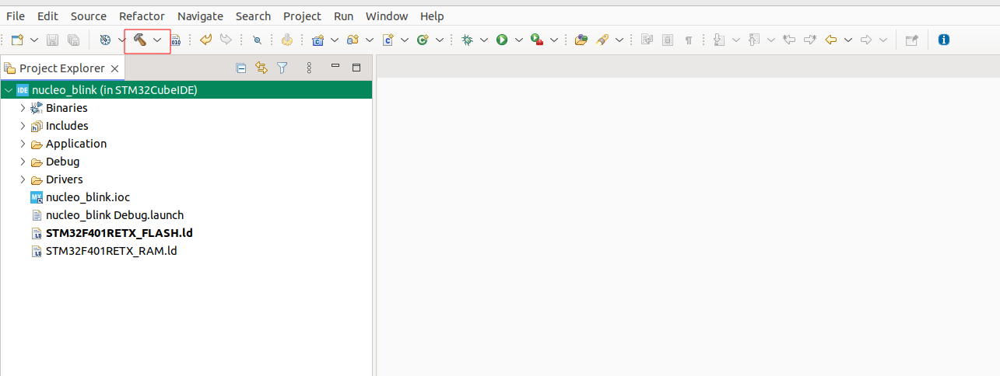

# Todo list

✓ == done
✗ == cancelled
1. Capture OpenOCD launch mode          ✓ 
2. Start OpenOCD process                ✓ -> bug: when re-open openocd launch mode then close seergdb, causing hang up on exit
3. Start GDB-multiarch process          
4. Connect GDB-multiarch to OpenOCD port
5. display source code debug on nucleo  
# To fix attach to target issue
2 solutions:
- ```sudo seergdb```
- Edit /etc/sysctl.d/10-ptrace.conf (or /etc/sysctl.d/99-sysctl.conf)<br>
```kernel.yama.ptrace_scope = 0```
# To build a new nucleo_blink LED:
- install cubeIDE:
Download CudeIDE .zip; extract to .sh
openocd terminal in fullscreen
sudo chmod 0777 .sh
sudo ./.sh
select Y and N installation
- import nucleo_blink to CubeIDE
Open CubeIDE: search for STM32CubeIDE on Show application when you press Windows key
File -> Import -> General -> Existing Project into Workspace -> specify path to nucleo_blink/STM32CubeIDE -> Done
If you don't see project source code on Project Explorer on the left side, try to close current tab
- Build elf image
click on nucleo_blink project icon on Project Explorer, Build Icon (hammer) will light up. Click on it to build

Final image is nucleo_blink.elf, its location is nucleo_blink/STM32CubeIDE/Debug/nucleo_blink.elf
This is symbol file which gdb-multiarch reads to debug MCU
# Debug using gdb-multiarch
openocd -f /home/quangnm/Documents/GitHub/seer/openocd/tcl/interface/jlink.cfg -f /home/quangnm/Documents/GitHub/seer/openocd/tcl/target/stm32f4x.cfg